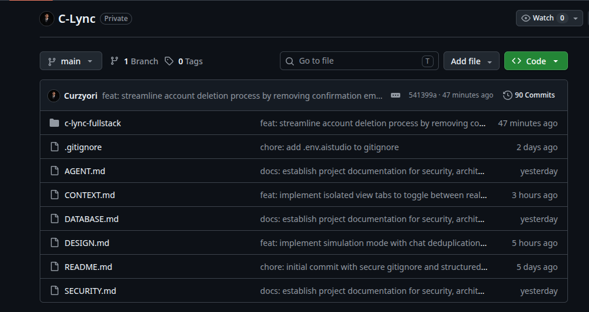

# 🚀 C-Lync (V1.5.0) — SaaS Manajemen & Otomatisasi WhatsApp Berbasis Google AI

<div align=\"center\">


</div>

---

### 📋 Mini Formula Project
**C-Lync** adalah **SaaS Manajemen & Otomatisasi WhatsApp** untuk **pemilik bisnis, tim Customer Service, dan developer** yang membantu **mengatasi kendala tumpukan pesan masuk (chat overload)** dengan fitur **AI Automated Summarization, Dynamic Contact Memory, dan Multi-Tenant Workspace**. Dibangun menggunakan **React.js, TypeScript, Express, dan Supabase PostgreSQL** karena **efisiensi arsitektur Unified Monolith yang mampu berjalan stabil di Google Cloud Run dengan batas RAM super ketat (< 512MiB)**.

> **🏆 Project Hasil Kompetisi #JuaraVibeCoding (Google Cloud Indonesia)**
>
> *Catatan Evaluasi Juri:*
> *Berkas ini merupakan **Mirror / Shadow Repository** yang dirancang khusus untuk menyajikan dokumentasi arsitektur sistem, bagan alur kerja, serta cetak biru struktur folder **C-Lync (Project Challenge 11/50)** secara transparan. Kode sumber inti (Core Engine) disimpan aman di dalam repositori privat demi melindungi token API komersial dan hak cipta kekayaan intelektual.*

---

## 🌐 Live Production Demo
Aplikasi telah dikompilasi ke level tertinggi (*Perfect Build Lock: 0 Errors & 0 Warnings*) dan berjalan live di infrastruktur Google Cloud Platform:
* **🔗 URL Aplikasi Live:** [https://c-lync-backend-266408539680.asia-southeast1.run.app](https://c-lync-backend-266408539680.asia-southeast1.run.app)

---

## 📝 Deskripsi Singkat & Solusi Masalah
Dalam ekosistem bisnis modern, penanganan tumpukan pesan pelanggan secara manual sering kali memicu keterlambatan respon dan hilangnya konteks preferensi kontak saat terjadi pergantian *shift* agen. C-Lync hadir sebagai asisten cerdas yang menjembatani WhatsApp Web Gateway dengan infrastruktur kecerdasan buatan Google untuk mengotomatisasikan rangkuman obrolan dan pencatatan memori data kontak secara asinkron.

### 🧠 Masalah yang Diselesaikan:
1. **Chat Overload:** Antrean ratusan pesan masuk per hari dari pelanggan yang memakan waktu lama jika harus dibaca manual satu per satu.
2. **Desinkronisasi State Konteks:** Agen kehilangan rekam jejak riwayat keluhan atau nomor order esensial dari pelanggan ketika agen berganti tugas.
3. **Overhead Infrastruktur Kontainer:** Kebutuhan komputasi server konvensional yang boros memori saat mengelola banyak sesi komunikasi real-time secara bersamaan.

### ✨ Solusi & Fitur Unggulan C-Lync:
* **AI Automated Summarization (Tombol SUMMARY):** Merangkum puluhan baris obrolan panjang menjadi satu baris informasi krusial instan menggunakan model LLM Gemini.
* **Dynamic Contact Memory:** Mengekstrak informasi preferensi unik dari pesan kontak secara otomatis langsung ke profil memori agen pintar.
* **Sleek Sub-Tab Isolation UI:** Pemisahan mutlak interaksi visual antarmuka klien ke dalam dua wilayah steril:
  1. *Tab PESAN NYATA:* Terhubung langsung ke Supabase Realtime Listener untuk meng-update counter unread badge secara dinamis berdasarkan pergerakan pesan asli di lapangan.
  2. *Tab SANDBOX SIMULASI:* Wilayah terisolasi in-memory untuk demo walkthrough onboarding langkah demi langkah (Step 1 - Step 5) tanpa mengotori tabel data produksi fisik.

---

## 🛠️ Tech Stack & Alasan Pemilihan
* **Frontend:** React.js, TypeScript, Tailwind CSS, Lucide Icons, dan Motion (Framer Motion). Dipilih untuk menghasilkan antarmuka taktil yang mematuhi standar ergonomi *touch targets* minimal $\ge 44$px lintas perangkat mobile/desktop.
* **Backend:** Express.js & Node.js yang dikemas dalam satu port bersama frontend (*Unified Monolith Architecture*) untuk meminimalkan *cold starts* dan memangkas penggunaan RAM server produksi.
* **AI Core Engine:** **Google AI Studio (Gemini API Pro Client SDK)**. Dipilih karena kecepatan inferensi yang sangat tinggi, pemahaman konteks bahasa alami lokal Indonesia yang unggul, dan efisiensi manajemen token.
* **Database & Security Guard:** **Supabase (PostgreSQL 17.6)**. Menegakkan isolasi data antar-pengguna secara mutlak lewat kebijakan perlindungan Row Level Security (RLS 100%) berbasis wrapper klausa `(select auth.uid())` untuk mencegah *CPU re-evaluation bottleneck*.

---

<div align="center">
  
</div>

---

## 🏗️ Struktur Folder Proyek (Architecture Blueprints)
Berikut adalah pohon direktori dari basis kode **C-Lync V1.1 (Challenge 11/50)** yang merepresentasikan seluruh modul, middleware keamanan, layanan AI, hingga konfigurasi skema database live:

```text
C-Lync-11/
└── c-lync-fullstack/
    ├── dist/                   # Hasil kompilasi static file frontend & backend bundle
    ├── public/                 # Aset grafik statis dan logo aplikasi
    ├── src/
    │   ├── components/         # Komponen UI Modular (BottomTabs, CustomDialog, dll)
    │   │   └── settings/       # Sektor pengaturan profil, billing, dan koneksi WA
    │   ├── context/
    │   │   └── AppContext.tsx  # Global State Management & state flag Onboarding
    │   ├── jobs/
    │   │   ├── autoCleanupJob.ts # Pembersih otomatis berkas sampah /tmp/sessions
    │   │   ├── userDeletionJob.ts
    │   │   └── userExportJob.ts
    │   ├── lib/
    │   │   ├── apiClient.ts    # Centralized Fetch wrapper untuk komunikasi API
    │   │   ├── geminiClient.ts # Klien SDK Google GenAI (Gemini Integration)
    │   │   └── supabase.ts     # Klien inisialisasi koneksi basis data Supabase
    │   ├── middleware/
    │   │   ├── auth.ts         # Autentikasi JWT guard untuk rute sensitif
    │   │   └── tokenQuotaCheck.ts # Sistem pembatas kuota penggunaan token AI
    │   ├── routes/
    │   │   ├── legal.ts        # Rute GDPR & Kebijakan Privasi Data Pengguna
    │   │   └── userRights.ts
    │   ├── scale/
    │   │   └── core/
    │   ├── screens/
    │   │   ├── AiAgents.tsx    # Layar interaksi chat dengan Agen AI Gemini
    │   │   ├── AuthScreen.tsx  # Layar otentikasi login/register multi-tenant
    │   │   ├── Automation.tsx  # Konfigurasi sistem pemicu otomatis respon WA
    │   │   ├── Chats.tsx       # Core UI (Sub-Tab: PESAN NYATA vs SANDBOX SIMULASI)
    │   │   ├── Dashboard.tsx   # Panel analitik performa token dan kuota pesan
    │   │   └── Settings.tsx    # Panel kendali utama profil bisnis
    │   ├── scripts/
    │   │   └── migrateSessionsToSupabase.ts # Skrip migrasi token Baileys
    │   ├── services/
    │   │   ├── baileyStateManager.ts  # Sinkronisasi multi-file auth WA ke Supabase
    │   │   ├── memoryBackupService.ts
    │   │   └── tokenQuotaService.ts   # Pemotong token AI kuota per-user
    │   ├── types/
    │   │   └── express.d.ts
    │   ├── utils/
    │   │   ├── promptBuilder.ts       # Konstruktor prompt aman (System Guard)
    │   │   └── promptOptimizer.ts     # Optimasi token konteks sebelum dikirim ke AI
    │   ├── App.tsx             # Root routing dan penataan layout utama
    │   ├── index.css           # Tailwind core directive stylesheet
    │   ├── main.tsx            # Entry point React Client Engine
    │   └── vite-env.d.ts
    ├── supabase/
    │   └── migrations/         # Berkas SQL skrip skema migrasi otomatis database
    ├── .gitignore
    ├── DESIGN.md               # Dokumentasi prinsip desain arsitektur visual
    ├── index.html              # HTML shell utama aplikasi SPA
    ├── metadata.json
    ├── package.json            # Daftar pustaka dependensi & skrip npm
    ├── package-lock.json
    ├── server.ts               # Core Engine Backend & Static Files Server (Express)
    ├── SUPABASE_SCHEMA.sql     # Skema lengkap RLS & Tabel Database Supabase
    ├── tsconfig.json           # Konfigurasi TypeScript compiler
    ├── vite.config.ts          # Konfigurasi bundler Vite (Frontend Engine)
    └── whatsappService.ts      # Integrasi Baileys WA Socket & Event Listener
```

---

## 🔄 Alur Kerja Sistem (System Usage Flow)
Arsitektur aplikasi berjalan secara linear dan responsif untuk menjamin penggunaan memori kontainer Cloud Run tetap berada di bawah ambang batas hemat 512MiB:

```text
[ Pengguna ] 
     │
     ├──► Login / Registrasi Akun (Aman dilindungi RLS Supabase 100%)
     │
     ├──► Sinkronisasi WhatsApp Web (Scan QR Code via Baileys multi-file auth)
     │
     ├──► Masuk ke Menu Core (Chats Screen)
     │
     ├───────► Mengklik Sub-Tab "SANDBOX SIMULASI"
     │         │
     │         └─► Membaca data `SIMULATED_CHATS` murni in-memory.
     │             Mengisolasi unread badge di angka 2 untuk keperluan demo walkthrough.
     │             Bypass penuh dari pemotongan kuota database fisik.
     │
     └───────► Mengklik Sub-Tab "PESAN NYATA"
               │
               └─► Menyalakan Postgres Realtime Channel Listener.
                   Membaca stream pesan WhatsApp riil yang masuk ke tabel database.
                   Counter badge visual bergerak dinamis (3, 4, 5, dst) secara real-time.

[ Sirkuit Otomatisasi Belakang Layar ]
     │
     ├──► Pesan Masuk ──► Disimpan Otomatis ke tabel `whatsapp_messages` via Supabase API
     │
     ├──► Klik Tombol "SUMMARY" ──► Payload pesan dikompilasi oleh `promptOptimizer.ts`
     │
     ├──► Eksekusi Inferensi ──► SDK Google AI Studio memproses ringkasan dengan kilat
     │
     └──► Update State Klien ──► Rangkuman 1 baris muncul di layar, RAM server terjaga aman < 512MiB
```

---

## 🛡️ Lisensi & Kepatuhan Keamanan Data
Lisensi: Proprietary / Komersial Terbatas khusus untuk keperluan Penjurian Lomba.

Keamanan Data: Dilengkapi sirkuit Auto-Cleanup pada direktori /tmp/sessions untuk menghapus token otentikasi usang, serta kepatuhan penuh terhadap enkripsi data multi-tenant di sisi basis data.

Dibuat dengan dedikasi penuh untuk ekosistem Google Cloud Indonesia pada ajang #JuaraVibeCoding 2026.
