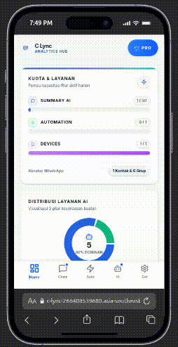

<p align="center">
  
</p>

<h1 align="center">C-Lync</h1>
<p align="center">
  <strong>SaaS Manajemen & Otomatisasi WhatsApp Berbasis Google AI</strong>
</p>

<p align="center">
  <a href="https://c-lync-266408539680.asia-southeast1.run.app/"><strong>🌐 Live Production</strong></a>
</p>

<div align="center">

[](https://github.com/Curzyori/c-lync/stargazers)
[](https://github.com/Curzyori/c-lync/network/members)
[](#license)
[](#)

</div>

<p align="center">
  <a href="#-why-c-lync">Why This</a> ·
  <a href="#-key-features">Features</a> ·
  <a href="#-tech-stack">Tech Stack</a> ·
  <a href="#-architecture">Architecture</a>
</p>

---

## 🕒 Why C-Lync?

<p align="center">
  
</p>

Chat WhatsApp numpuk, pertanyaan yang sama berulang, respon lambat. Pemilik bisnis kecil keteteran balas chat manual seharian.

C-Lync hadir sebagai asisten cerdas yang menjembatani WhatsApp Web Gateway dengan infrastruktur kecerdasan buatan Google untuk mengotomatisasikan rangkuman obrolan dan pencatatan memori data kontak secara asinkron.

|                               |                                                              |
| ----------------------------- | ------------------------------------------------------------ |
| ⚡ **AI Chat Summarization**  | Rangkum puluhan pesan panjang jadi 1 baris info krusial instan |
| 🔒 **Dynamic Contact Memory** | AI ekstrak preferensi kontak otomatis ke profil memori |
| 🛡️ **Multi-Tenant Security** | Isolasi data 100% via Supabase RLS per-user |

---

## 🎯 Key Features

### AI-Powered Capabilities

| Feature | Status | Description |
| :--- | :---: | :--- |
| **AI Automated Summarization** | ✅ | Merangkum puluhan baris obrolan panjang menjadi satu baris informasi krusial instan |
| **Dynamic Contact Memory** | ✅ | Mengekstrak informasi preferensi unik dari pesan kontak secara otomatis |
| **Gemini AI Integration** | ✅ | Pemahaman konteks bahasa Indonesia yang unggul via Google AI Studio |

### Core Platform Features

| Feature | Status | Description |
| :--- | :---: | :--- |
| **Web-based Dashboard** | ✅ | Akses dari browser, ga perlu install aplikasi tambahan |
| **Multi-Conversation Handling** | ✅ | Kelola banyak chat WhatsApp dari satu dashboard terpusat |
| **Sub-Tab Isolation UI** | ✅ | Pemisahan steril antara demo walkthrough dan data produksi |
| **Realtime Badge Counter** | ✅ | Counter unread badge bergerak dinamis via Supabase Realtime |

### Infrastructure

| Feature | Status | Description |
| :--- | :---: | :--- |
| **Google Cloud Run Deployment** | ✅ | Berjalan di GCP dengan RAM hemat < 512MiB |
| **Unified Monolith Architecture** | ✅ | Frontend + Backend dalam satu port untuk minimalkan cold starts |
| **PostgreSQL 17 + RLS 100%** | ✅ | Isolasi data multi-tenant via Row Level Security |

---

## 🛠️ Tech Stack

| Layer | Technology | Why |
| :---- | :--------- | :-- |
| **Frontend** | React.js, TypeScript, Tailwind CSS, Framer Motion | Antarmuka taktil dengan touch targets >= 44px |
| **Backend** | Express.js, Node.js | Unified monolith, minimal cold starts |
| **AI Engine** | Google AI Studio (Gemini Pro SDK) | Kecepatan inferensi tinggi, konteks ID unggul |
| **Database** | Supabase (PostgreSQL 17.6) | RLS 100%, Realtime subscription |
| **Deployment** | Google Cloud Run | Scalable serverless container |

---

## 🏗️ Architecture

```
c-lync/
├── images/                  # Visual assets (banner, demo gif)
├── src/
│   ├── components/         # Modular UI components (BottomTabs, CustomDialog)
│   │   └── settings/       # Profile, billing, WA connection settings
│   ├── context/
│   │   └── AppContext.tsx  # Global state + onboarding flag
│   ├── jobs/               # Background jobs (autoCleanup, userDeletion)
│   ├── lib/
│   │   ├── apiClient.ts    # Centralized fetch wrapper
│   │   ├── geminiClient.ts # Google GenAI SDK integration
│   │   └── supabase.ts     # Database client
│   ├── middleware/
│   │   ├── auth.ts         # JWT authentication guard
│   │   └── tokenQuotaCheck.ts  # AI token quota limiter
│   ├── routes/              # Legal routes (GDPR, Privacy Policy)
│   ├── screens/
│   │   ├── AiAgents.tsx    # Gemini AI chat interaction
│   │   ├── AuthScreen.tsx   # Multi-tenant login/register
│   │   ├── Chats.tsx       # Core UI (Real vs Sandbox tabs)
│   │   ├── Dashboard.tsx    # Token analytics & quota panel
│   │   └── Settings.tsx     # Business profile controls
│   ├── services/
│   │   ├── baileyStateManager.ts  # WA multi-file auth sync
│   │   ├── memoryBackupService.ts
│   │   └── tokenQuotaService.ts   # Per-user AI quota cutter
│   └── utils/
│       ├── promptBuilder.ts       # Safe prompt constructor
│       └── promptOptimizer.ts     # Context token optimizer
├── supabase/
│   └── migrations/         # SQL schema migrations
├── server.ts               # Express core engine + static server
├── whatsappService.ts      # Baileys WA Socket integration
├── SUPABASE_SCHEMA.sql     # Complete RLS + table schema
└── package.json            # Dependencies
```

---

## ⚙️ System Flow

```
[ User ]
  │
  ├── Login / Register (protected by Supabase RLS 100%)
  │
  ├── WhatsApp Web Sync (scan QR via Baileys multi-file auth)
  │
  └── Core Menu (Chats Screen)
        │
        ├── SANDBOX SIMULASI TAB
        │     └── Pure in-memory demo, bypass database quota
        │
        └── PESAN NYATA TAB
              └── PostgreSQL Realtime Listener
                    └── Badge counter updates dynamically

[ Background Circuit ]
  │
  ├── Pesan Masuk ──► Save to whatsapp_messages table
  │
  ├── Klik "SUMMARY" ──► promptOptimizer.ts compiles payload
  │
  ├── Inferensi ──► Google AI Studio processes summary
  │
  └── RAM Server stays < 512MiB
```

---

## 🏆 Awards

> **Project Hasil Kompetisi #JuaraVibeCoding (Google Cloud Indonesia)**

*Catatan Evaluasi Juri:* Berkas ini merupakan **Mirror / Shadow Repository** yang dirancang khusus untuk menyajikan dokumentasi arsitektur sistem, bagan alur kerja, serta cetak biru struktur folder **C-Lync (Project Challenge 11/50)** secara transparan. Kode sumber inti (Core Engine) disimpan aman di dalam repositori privat demi melindungi token API komersial dan hak cipta kekayaan intelektual.

---

## 📦 License

This repository is a **public documentation mirror** for the C-Lync project.

- **Core Code:** Proprietary / Komersial Terbatas — disimpan di repositori privat
- **Documentation:** Mirror ini disediakan untuk transparansi arsitektur dan portfolio

For licensing inquiries, contact the author.

---

## 🔗 Connect

<p align="center">
  <a href="https://github.com/Curzyori">
    
  </a>
  <a href="https://curzy.dev">
    
  </a>
  <a href="https://linkedin.com/in/curzy">
    
  </a>
</p>

<sub>Built with passion as the 11th Project of the <strong>50 Projects Challenge</strong> by <strong>@curzyori</strong></sub>
